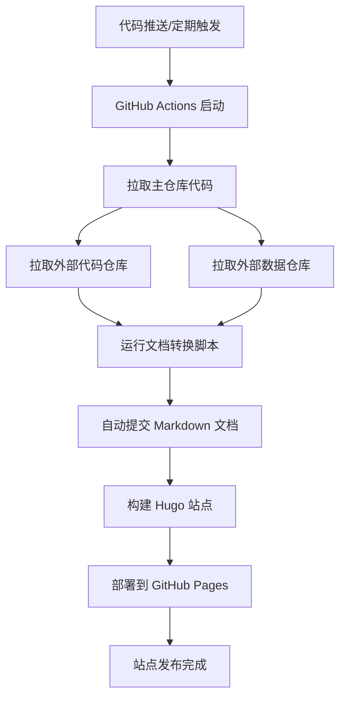

# 中国法律法规在线文库 - 部署指南

## 1. 部署概述

该项目采用 **GitHub Pages + GitHub Actions** 实现全自动化部署，无需手动干预即可完成从代码更新到站点发布的完整流程。部署系统设计为双阶段架构，确保数据更新与站点构建的可靠性和可维护性。

## 2. 部署架构

### 2.1 核心组件

| 组件 | 作用 | 说明 |
|------|------|------|
| **GitHub Pages** | 静态站点托管 | 提供免费的静态站点托管服务，支持自定义域名 |
| **GitHub Actions** | CI/CD 自动化 | 执行自动化构建、测试和部署流程 |
| **Hugo** | 静态站点生成器 | 将 Markdown 内容转换为静态 HTML 站点 |
| **外部数据仓库** | 法律文档存储 | 独立存储原始 DOCX 格式法律文档 |
| **外部代码仓库** | 处理脚本存储 | 存储文档转换和处理脚本 |

### 2.2 部署流程图



## 3. 部署配置详解

### 3.1 GitHub Actions 工作流配置

核心配置文件：`.github/workflows/deploy.yml`

#### 3.1.1 工作流基本信息

```yaml
name: GitHub Pages

on:
  push:
    branches:
      - main
    paths-ignore:
      - "README.md"
      - ".gitignore"
  workflow_dispatch:
  schedule:
    - cron: "5 5 * * 6"
```

- **工作流名称**：GitHub Pages
- **触发条件**：
  - 主分支代码推送（忽略 README.md 和 .gitignore）
  - 手动触发（workflow_dispatch）
  - 每周六 UTC 5:05 自动运行

#### 3.1.2 环境变量配置

```yaml
env:
  USER: ${{ github.repository_owner }}
  REPO: ${{ github.event.repository.name }}
  CODE: ${{ secrets.REPO }}
  DATA: ${{ secrets.DATA }}
  SRC_NAME: source
  DATA_NAME: data
```

- **USER**：当前仓库所有者
- **REPO**：当前仓库名称
- **CODE**：外部代码仓库名称（从 GitHub Secrets 获取）
- **DATA**：外部数据仓库名称（从 GitHub Secrets 获取）
- **SRC_NAME**：外部代码仓库本地目录名
- **DATA_NAME**：外部数据仓库本地目录名

#### 3.1.3 权限配置

```yaml
permissions:
  contents: write
  pages: write
  id-token: write
```

- **contents: write**：允许修改仓库内容（用于提交更新的文档）
- **pages: write**：允许部署 GitHub Pages
- **id-token: write**：允许生成部署所需的身份令牌

## 4. 自动化部署流程

### 4.1 第一阶段：数据处理（process 作业）

| 步骤 | 操作 | 命令 | 说明 |
|------|------|------|------|
| 1 | 检出主仓库代码 | `actions/checkout@v4` | 获取最新的站点代码 |
| 2 | 检出外部代码仓库 | `actions/checkout@v4` | 从外部仓库拉取文档处理脚本 |
| 3 | 检出外部数据仓库 | `actions/checkout@v4` | 从外部仓库拉取原始 DOCX 文档 |
| 4 | 设置 Python 环境 | `actions/setup-python@v5` | 配置 Python 3.x 环境用于文档转换 |
| 5 | 运行文档转换脚本 | `bash scripts/process-format.sh ${DATA_NAME} content -1` | 将 DOCX 转换为 Markdown 并格式化 |
| 6 | 自动提交更新 | `stefanzweifel/git-auto-commit-action@v6` | 将转换后的 Markdown 提交到主仓库 |

#### 4.1.1 文档转换脚本详解

脚本位置：`${SRC_NAME}/scripts/process-format.sh`

功能：
- 遍历外部数据仓库中的 DOCX 文件
- 使用 `markitdown` 工具将 DOCX 转换为 Markdown
- 对转换后的 Markdown 进行格式化处理
- 按分类将文档输出到 `content/` 目录

### 4.2 第二阶段：站点构建与部署（deploy 作业）

| 步骤 | 操作 | 命令 | 说明 |
|------|------|------|------|
| 1 | 检出主仓库代码 | `actions/checkout@v4` | 获取包含更新文档的最新代码 |
| 2 | 配置 Hugo 环境 | `peaceiris/actions-hugo@v3` | 安装最新版本的 Hugo 扩展版 |
| 3 | 配置 Node.js 环境 | `pnpm/action-setup@v4` | 设置 pnpm 包管理器 |
| 4 | 安装依赖 | `pnpm install` | 安装项目依赖 |
| 5 | 更新 Hugo 模块 | `hugo mod get -u && hugo mod tidy` | 更新 Docsy 主题和其他 Hugo 模块 |
| 6 | 构建站点 | `hugo --gc --minify --baseURL https://${REPO_OWNER}.github.io` | 生成优化的静态站点文件 |
| 7 | 配置 GitHub Pages | `actions/configure-pages@v5` | 设置 Pages 部署环境 |
| 8 | 上传构建产物 | `actions/upload-pages-artifact@v4` | 将 public 目录上传为部署制品 |
| 9 | 部署到 Pages | `actions/deploy-pages@v4` | 将制品部署到 GitHub Pages |

#### 4.2.1 Hugo 构建参数说明

- **--gc**：启用垃圾回收，清理未使用的资源
- **--minify**：压缩 HTML、CSS、JavaScript 和 JSON 文件
- **--baseURL**：指定站点基础 URL

## 5. 手动部署步骤

### 5.1 环境准备

#### 5.1.1 安装 Hugo

```bash
# macOS (Homebrew)
brew install hugo

# Windows (Chocolatey)
choco install hugo-extended

# Linux (Snap)
sudo snap install hugo --channel=extended
```

#### 5.1.2 安装 pnpm

```bash
npm install -g pnpm
```

### 5.2 部署操作

1. **克隆仓库**
   ```bash
   git clone https://github.com/lawnav/lawnav.github.io.git
   cd lawnav.github.io
   ```

2. **安装依赖**
   ```bash
   pnpm install
   ```

3. **更新 Hugo 模块**
   ```bash
   hugo mod get -u && hugo mod tidy
   ```

4. **构建站点**
   ```bash
   hugo --gc --minify --baseURL https://lawnav.github.io
   ```

5. **部署到 GitHub Pages**
   ```bash
   # 方法 1：使用 git 直接推送到 gh-pages 分支
   git subtree push --prefix public origin gh-pages
   
   # 方法 2：使用 gh 命令行工具（需要安装 GitHub CLI）
   gh pages deploy --dir public
   ```

## 6. 本地部署

### 6.1 本地构建

在本地环境构建站点，生成静态文件：

```bash
# 构建站点，输出到 public 目录
hugo --gc --minify --baseURL http://localhost:1313
```

**构建参数说明**：
- `--gc`：启用垃圾回收，清理未使用的资源
- `--minify`：压缩 HTML、CSS、JavaScript 和 JSON 文件
- `--baseURL`：指定本地预览的基础 URL

### 6.2 本地预览

#### 方法 1：使用 Hugo 内置服务器（推荐）

```bash
# 启动本地开发服务器
hugo server --bind=0.0.0.0 --port=1313 --baseURL=http://localhost:1313
```

**参数说明**：
- `--bind=0.0.0.0`：允许外部访问
- `--port=1313`：指定端口号
- `--baseURL`：设置基础 URL

启动成功后，访问 `http://localhost:1313` 即可查看本地站点。

**特性**：
- 自动重载：修改文件后自动刷新页面
- 实时预览：实时查看修改效果

#### 方法 2：使用静态文件服务器

```bash
# 安装 serve 工具（如果未安装）
npm install -g serve

# 在 public 目录启动服务器
cd public
serve -s -l 1313
```

访问 `http://localhost:1313` 即可查看本地站点。

### 6.3 本地开发注意事项

1. **文档更新**
   - 本地部署时，可以修改 `content` 目录下的 Markdown 文档来测试站点效果
   - 使用 Hugo 内置服务器时，修改文件会自动刷新页面

2. **主题定制**
   - 修改 `assets/scss/_variables_project.scss` 自定义样式
   - 修改 `layouts` 目录下的模板文件自定义页面结构
   - 自定义组件位于 `layouts/_partials/` 目录

3. **配置修改**
   - 修改 `hugo.toml` 文件可以调整站点配置
   - 包括站点标题、导航栏、侧边栏、搜索功能等

### 6.4 本地部署常见问题

#### 6.4.1 Hugo 版本不兼容

**症状**：构建时出现版本错误

**解决方案**：升级 Hugo 到指定版本
```bash
# macOS
brew upgrade hugo

# Windows
choco upgrade hugo-extended

# Linux
sudo snap refresh hugo --channel=extended
```

#### 6.4.2 模块更新失败

**症状**：执行 `hugo mod get -u` 时失败

**解决方案**：
- 检查网络连接
- 清理模块缓存
```bash
hugo mod clean
```
- 重新初始化模块
```bash
hugo mod init github.com/lawnav/lawnav.github.io
```

#### 6.4.3 本地预览页面样式异常

**症状**：页面布局错乱，样式缺失

**解决方案**：
- 确保已正确安装 Hugo 扩展版
- 重新执行 `hugo mod get -u && hugo mod tidy`
- 检查 `hugo.toml` 中的主题配置是否正确

#### 6.4.4 搜索功能无法使用

**症状**：本地预览时搜索功能失效

**解决方案**：
- 本地环境下 Algolia 搜索可能无法正常工作（需要 API 密钥）
- 可以通过修改 `hugo.toml` 暂时禁用搜索功能
```toml
# 注释掉 Algolia 配置
# [params.search.algolia]
# indexName = "algolia_site_articles"
# appId = "3X0X6KF7SS"
# apiKey = "cd70b06ccd99eeeb94ebca076c1c0a98"
```

## 7. 部署状态监控

### 7.1 查看部署日志

1. 登录 GitHub，进入项目仓库
2. 点击顶部导航栏的 **Actions** 标签
3. 在左侧列表中选择 **GitHub Pages** 工作流
4. 点击具体的运行记录查看详细日志

### 7.2 部署状态检查

| 检查项 | 检查方法 | 预期结果 |
|--------|----------|----------|
| 工作流运行状态 | GitHub Actions 页面 | 绿色对勾（成功）或红色叉号（失败） |
| 站点访问 | 直接访问 https://lawnav.github.io | 站点正常加载，显示最新内容 |
| 页面更新时间 | 查看页面底部的最后更新时间 | 与部署时间一致 |

## 8. 故障排查

### 8.1 常见问题及解决方案

#### 8.1.1 文档转换失败

**症状**：
- 工作流在 `Run format markdown` 步骤失败
- 日志显示转换脚本错误

**解决方案**：
- 检查外部数据仓库中的 DOCX 文件格式是否正确
- 验证 Python 环境配置是否正确
- 检查转换脚本是否存在语法错误

#### 8.1.2 Hugo 构建失败

**症状**：
- 工作流在 `Build Site` 步骤失败
- 日志显示 Hugo 构建错误

**解决方案**：
- 检查 Hugo 版本是否符合要求（>= 0.146.0 扩展版）
- 验证 Hugo 模块配置是否正确
- 检查 Markdown 文件格式是否符合 Hugo 要求

#### 8.1.3 部署到 Pages 失败

**症状**：
- 工作流在 `Deploy to GitHub pages` 步骤失败
- 日志显示 Pages 部署错误

**解决方案**：
- 检查 GitHub Pages 配置是否正确
- 验证仓库权限设置
- 确认 `public` 目录生成正常

### 8.2 日志分析技巧

1. **查看完整日志**：点击工作流运行记录中的 "View raw logs" 查看完整日志
2. **搜索错误信息**：使用浏览器的查找功能（Ctrl+F）搜索 "error" 或 "failed" 关键词
3. **检查依赖版本**：确保所有依赖版本符合要求
4. **对比成功运行日志**：与之前成功的运行日志进行对比，找出差异

## 9. 部署最佳实践

### 9.1 代码管理

- **使用分支管理**：开发新功能时使用 feature 分支，测试通过后合并到 main 分支
- **提交规范**：采用清晰的提交信息，便于追溯变更
- **定期更新依赖**：定期更新 Hugo 主题和其他依赖，确保安全性和稳定性

### 9.2 数据管理

- **数据备份**：定期备份外部数据仓库，防止数据丢失
- **数据验证**：在转换前验证 DOCX 文件的完整性和格式
- **增量更新**：考虑实现增量更新机制，只处理新增或修改的文档

### 9.3 性能优化

- **启用缓存**：在 GitHub Actions 中启用依赖缓存，加快构建速度
- **优化 Hugo 配置**：调整 Hugo 构建参数，优化构建输出
- **使用 CDN**：考虑使用 CDN 加速静态资源访问

### 9.4 监控与告警

- **设置部署通知**：配置 GitHub Actions 通知，部署失败时及时提醒
- **定期检查站点状态**：使用外部监控工具定期检查站点可访问性
- **分析访问日志**：使用 Google Analytics 等工具分析站点访问情况

## 10. 部署架构优化建议

### 10.1 多环境部署

考虑添加开发环境和测试环境，实现完整的环境隔离：

- **开发环境**：用于开发和测试新功能
- **测试环境**：用于验证文档转换和站点构建
- **生产环境**：正式对外发布的站点

### 10.2 部署回滚机制

添加部署回滚功能，当部署失败或出现问题时能够快速回滚到之前的稳定版本：

- 保存每次部署的构建产物
- 实现一键回滚功能
- 配置回滚触发条件

### 10.3 增强安全性

- **使用 GitHub Environments**：为部署环境配置环境变量和 secrets
- **启用代码扫描**：配置 GitHub Code Scanning 检测潜在安全问题
- **定期更新依赖**：使用 Dependabot 自动更新依赖，修复安全漏洞

## 11. 总结

该项目的部署架构设计清晰，自动化程度高，能够实现从数据更新到站点发布的全流程自动化。通过 GitHub Actions 工作流，项目实现了定期自动更新法律文档，并将最新内容发布到 GitHub Pages。

对于开发和测试，可以通过本地部署快速预览和调试站点，使用 Hugo 内置服务器实现实时预览。在实际运维过程中，建议关注部署日志、定期检查站点状态，并根据实际需求进行架构优化，确保站点的可靠性、安全性和性能。

通过遵循本部署指南，您可以完全理解项目的部署机制，并能够独立进行部署操作和故障排查。